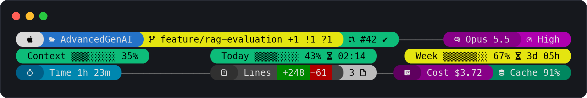
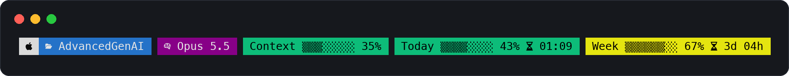
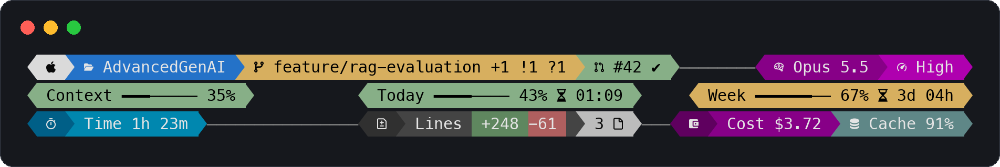
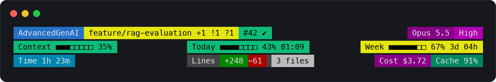

# claude-statusline

A Powerlevel10k-style statusline for [Claude Code](https://code.claude.com): rounded pills, usage bars, and session stats in three lines. Pure Bash. The installer asks you how you want it, question by question, like the Powerlevel10k wizard.



## What it shows

| Line | Segment | Meaning |
|---|---|---|
| 1 | Project | Folder of the session. It follows the worktree when you switch. |
| 1 | Branch | Branch and git counts, with p10k symbols: `⇡ahead ⇣behind +staged !modified ?untracked ~conflicts`. Green when clean, yellow with changes. Shown inside git worktrees. |
| 1 | PR | Open pull request of the branch: `✔` approved, `●` pending, `✘` changes requested, `✎` draft. |
| 1 | `/rename` | Reminder to name the session. It disappears once you run `/rename`. |
| 1 | Model · Effort | Model of the session, colored by family, and the reasoning effort. `󱐋` marks fast mode. |
| 2 | Context | Context window used. |
| 2 | Today | 5-hour usage limit and time until it resets. |
| 2 | Week | 7-day usage limit and time until it resets. |
| 3 | Time | Session duration. |
| 3 | Lines | Lines added and removed in the session, as a proportional bar, plus files changed in the repo. |
| 3 | Cost · Cache | Estimated session cost in USD and prompt-cache hit ratio. Grey with `󰜗` when the cache has gone cold. |

Usage bars turn green, yellow, and red at 60% and 80%. Pills wrap to new lines and spread across the full terminal width, like p10k.

## Styles

Two presets, both from versions I have used day to day:

| Preset | Look |
|---|---|
| `p10k` (default) | The image above: three lines, round pills. |
| `classic` | One line, flat pills. <br> |

Every option can be changed on top of a preset. Two examples:

| Options | Look |
|---|---|
| `--style angled --bar line --colors soft` |  |
| `--icons none --bar block --gap none` (no Nerd Font needed) |  |

| Option | Values | Default (`p10k`) |
|---|---|---|
| `--preset` | `p10k`, `classic` | `p10k` |
| `--icons` | `nerd`, `none` (without a Nerd Font; forces `flat`) | `nerd` |
| `--style` | `round`, `angled`, `flat` | `round` |
| `--layout` | `full` (three lines), `compact` (one line, wraps when it does not fit) | `full` |
| `--segments` | `all` or a comma-separated list of `project`, `rename`, `branch`, `pr`, `model`, `effort`, `context`, `today`, `week`, `time`, `lines`, `cost`, `cache` | `all` |
| `--bar` | `shade` (`▒░`), `line` (`━─`), `block` (`■□`), `none` | `shade` |
| `--colors` | `vivid`, `soft` | `vivid` |
| `--gap` | `line` (`───` between pills), `none` | `line` |

The installer saves your choices to `~/.claude/statusline.conf`, one `key=value` per line. The statusline reads that file and never runs it as code. Options you do not set come from the preset.

## Requirements

- A [Nerd Font](https://www.nerdfonts.com/) in your terminal (for example, MesloLGS NF, the font Powerlevel10k recommends). Without one, choose `--icons none`.
- Bash, git, and awk (preinstalled on macOS and Linux).
- A recent version of Claude Code. Segments whose data the payload does not include are hidden.

## Install

```bash
curl -fsSL https://raw.githubusercontent.com/sergiomorapardo/claude-statusline/main/install.sh | bash
```

In a terminal, the installer first asks you how you want it: whether you see the icons, a preset, and then, if you want, each option with a live preview. `r` restarts and `q` quits without changing anything. To answer the questions again later:

```bash
curl -fsSL https://raw.githubusercontent.com/sergiomorapardo/claude-statusline/main/install.sh | bash -s -- --configure
```

To skip the questions, pass the options as flags. Options you leave out keep their saved value:

```bash
curl -fsSL https://raw.githubusercontent.com/sergiomorapardo/claude-statusline/main/install.sh | bash -s -- --preset classic --colors soft
```

The installer copies the script to `~/.claude/statusline.sh` and adds the `statusLine` block to `~/.claude/settings.json`. The rest of your settings stay as they are. It backs up any file it changes, and you can run it again to update. If you already have another statusline, it stops without changing anything. Add `--force` to replace it.

It respects `CLAUDE_CONFIG_DIR` and needs `jq` or `python3` to edit the settings. `--help` lists every option.

### Install with Claude Code

Paste this into Claude Code:

```text
Install the statusline from https://github.com/sergiomorapardo/claude-statusline following its README.
```

### Instructions for agents

If you are an AI agent installing this statusline for a user, do not edit `statusline.sh` or `statusline.conf`. Every option is a flag of the installer.

1. Ask the user how they want it, in this order. Offer the default first.
   - Does their terminal use a [Nerd Font](https://www.nerdfonts.com/)? If they do not know, it is the font Powerlevel10k uses. If not, pass `--icons none`.
   - Preset: `p10k` (three lines, the main image) or `classic` (one line). Point them to the images in the [Styles](#styles) section.
   - Ask whether they want to change anything else. Only then ask about style, layout, bars, colors, gap, and segments, with the values from the options table.
2. Run the installer with their answers as flags, for example:
   `curl -fsSL https://raw.githubusercontent.com/sergiomorapardo/claude-statusline/main/install.sh | bash -s -- --preset classic --icons none`.
   Without a terminal it never asks questions. If the user prefers the interactive wizard, tell them to run the command in the Install section in their own terminal.
3. Check the exit code:
   - `0`: installed. Tell the user to send a message or restart Claude Code to see it.
   - `2`: the user already has another statusline. Nothing was changed. Show the user the command the installer printed and ask whether to replace it. Run again with `bash -s -- --force` only after the user says yes.
   - `1`: show the error to the user. Do not edit `settings.json` by hand to work around it.
4. To change the style later, run the installer again with only the flags that change, for example `bash -s -- --bar line`.
5. Tell the user that the icons need a [Nerd Font](https://www.nerdfonts.com/) in their terminal. If they look like boxes or question marks, the terminal font is the cause.

### Manual install

Download the script:

```bash
curl -fsSL https://raw.githubusercontent.com/sergiomorapardo/claude-statusline/main/statusline.sh -o ~/.claude/statusline.sh
```

Add this to `~/.claude/settings.json`. To change the style, create `~/.claude/statusline.conf` with the options from the table, for example `preset=classic`:

```json
{
  "statusLine": {
    "type": "command",
    "command": "bash ~/.claude/statusline.sh",
    "padding": 0,
    "refreshInterval": 2
  }
}
```

`refreshInterval` keeps the session time and the reset countdowns up to date between messages.

## How it works

Claude Code sends a JSON payload to the script on stdin. The script reads it with `grep` and `sed` (no `jq` needed) and calls `git status` on the session folder. It makes no network calls and reads the transcript only to detect whether the session has a custom name.

Comments in the script are in Spanish.

## License

[MIT](LICENSE) © Sergio A. Mora Pardo · [GitHub](https://github.com/sergiomorapardo) · [LinkedIn](https://www.linkedin.com/in/sergiomorapardo/)
